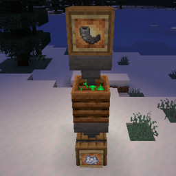

<div align="left">

# Data Driven Composter

A server-sided composter mod that allows you to customise what you can feed to composters for Fabric & Quilt!

## How to Use?

Requirements:

- Minecraft 1.18.2+
- [Data Driven Composter](https://github.com/Modflower/data-driven-composter/releases)
- One of either mod loader:
    - [Quilt](https://quiltmc.org/install)
    - [Fabric](https://fabricmc.net/use)

Install Minecraft 1.18.2 or 1.19, DDC and your mod loader of choice, then customise the config at `config/ddc.json`. No client
mod is required, but you may install to use it in single player or with LAN.

## Config - `ddc.json`

*Example configuration*

Note, by default, the entire registry *will* be present.

```json5
{
   // Whether to disable vanilla registration. Set this to true if
   // you'd like to define your own values for vanilla's stuff.
   "disableDefaultVanillaRegistry": false,
   // Whether registration should be logged or not.
   // Disabled by default due to it spamming stack traces for each call.
   "logAllDirectRegistration": false,
   // Items that can be composted in a composter.
   // Identifier -> Chance
   "compostableItems": {
      "minecraft:glow_lichen": 0.5,
      "minecraft:poppy": 0.65,
      "minecraft:cocoa_beans": 0.65,
      "minecraft:azalea": 0.65,
      "minecraft:nether_wart": 0.65,
      ...
   }
}
```

- `disableDefaultVanillaRegistry`
    - `true`: Disables Vanilla registration.
    - `false`: Keep Vanilla registration.
- `logAllDirectRegistration`: Debugging option.
    - `true`: Logs all registrations to the composter block.
    - `false`: Does not log any registration to the composter block.
- `compostableItems`
    - `minecraft:...`: Identifier for the item to allow composting of.
    - `0 - 1`: Chance between 0 & 1 for an item to add to the composter.

## Planned Features

- [ ] Customisable returns with chance
- [ ] 
  QSL's [RegistryEntryAttachment](https://github.com/QuiltMC/quilt-standard-libraries/blob/1.18/library/data/registry_entry_attachments/src/main/java/org/quiltmc/qsl/registry/attachment/api/RegistryEntryAttachment.java)
  for more dynamic initialisation.
- [ ] Custom Datapack Recipe type to allow for datapacks to register compostable items.

</div>